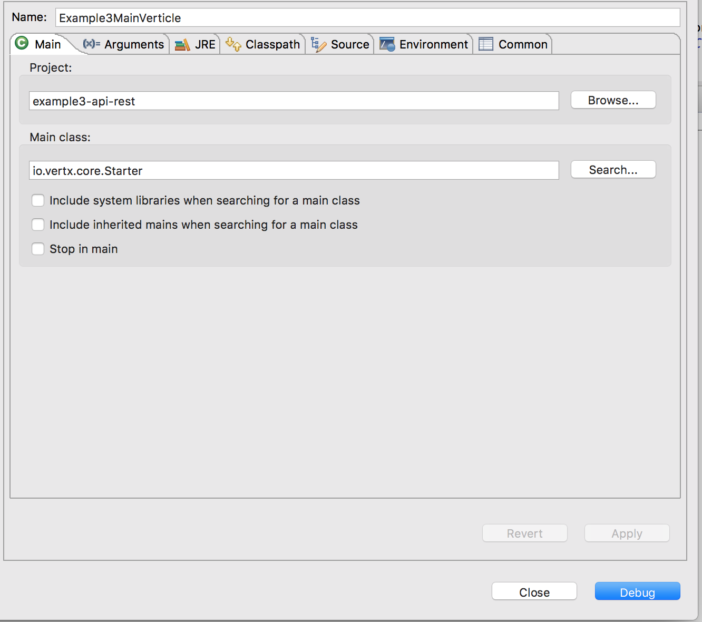
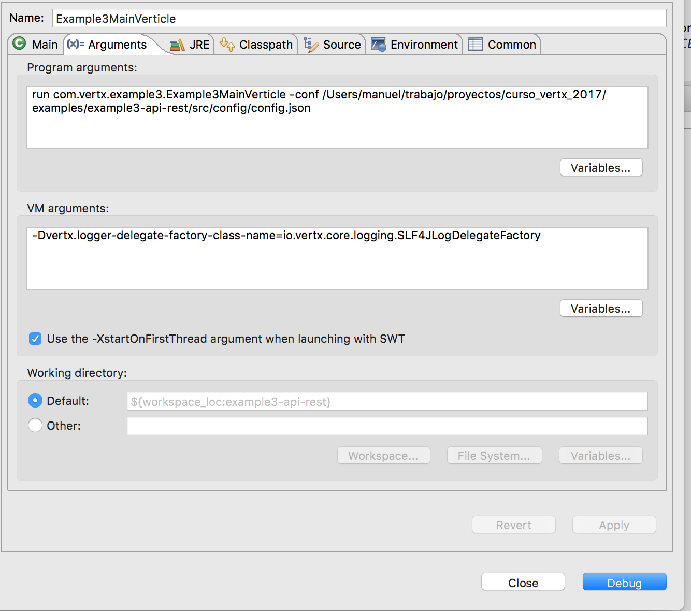

### Curso Vert.x | : Ejemplos: "El nacimiento de un super Saiyan"
--------
La totalidad de este ejemplo y codigo es creación de [Paradigma Digital]( https://www.paradigmadigital.com/). La fuente original la podéis encontrar [aquí](https://github.com/paradigmadigital/curso-vertx-1).
La intencion de realizar este repositorio es para uso personal y ademas para clarificar:
``` 
	1. La dependencia de Lib Microservice Common, que yo agregue dentro del mismo repositorio.
	2. La generacion de codigo en el manejo de los Vert.x service proxies la clase SensorDTOConverter.
```
Fue creado como curso por un exclente equipo de desarrollo:
 - J.Manuel García Rozas (Arquitecto) 
 - Ernesto Valero (Arquitecto de sistemas) 
 - Teresa Quintano (Front Developer)  


--------


#### Lib Microservice Common
--------

Librería perteneciente al ejemplo de microservicios en Vert.x, que en este repositorio esta con el nombre de "curso-vertx-libs-master". La fuente original la puedes encontrar [aquí](http://www.sczyh30.com/vertx-blueprint-microservice/index.html#blueprint-common-module).

>Se debe ejecutar la construcción de esta librería ya que los ejemplos hacen uso de ella de la siguiente manera:
```
  1. En un CMD deberas navegar en el cmd a la carperta que contiene el codigo principal en la carpeta curso-vertx-libs-master
  2. Deberas compilar "mvn compile"
  3. Deberas aplicar mvn clean install
  4. Ello colocara en el repositorio locar C:\Users\ap-gomez\.m2\repository\io\vertx\blueprint la carpeta de microservice-lib-common con la version de 3.4.2-SNAPSHOT
  5. En el pom.xml de example3-api-rest la dependencia se debera ver de la siguiente manera:
	<dependency>
		<groupId>io.vertx.blueprint</groupId>
		<artifactId>microservice-lib-common</artifactId>
		<version>3.4.2-SNAPSHOT</version>
	</dependency>
  6. Con todo lo anterior el proyecto deberia reconocer la dependencia.
```
 


#### Ejemplos
--------
- [Lib Microservice Common](https://github.com/ingapoloperseo/vERT.x-MainVerticleFirst/tree/master/curso-vertx-libs-master): Libreria base para el manejo de multiples funciones comunes.
- [Ejemplo 1](https://github.com/ingapoloperseo/vERT.x-MainVerticleFirst/tree/master/example1-http-server): Aprendizaje básico de creación de un servidor http.
- [Ejemplo 2](https://github.com/ingapoloperseo/vERT.x-MainVerticleFirst/tree/master/example2-templates-client): Uso de Módulo web + plantillas + socket server
- [Ejemplo 3](https://github.com/ingapoloperseo/vERT.x-MainVerticleFirst/tree/master/example3-api-rest): Creación de un REST-API

  
####  Requisitos básicos
--------

- Maven 3.X
- Jdk 1.8
- VisualVM
- Jmeter
- MongoDB

####  Recursos
--------

- Fichero build_and_run.sh
- Jmeter
- Postman

   
####  Configura el arranque en tu IDE de cualquiera de los ejemplos
--------

En eclipse (o el IDE que se desee) ejecutar el Verticle que se quiera del siguiente modo:

 - Seleccionar la clase Starter como "MainClass"
 
 	
 
 	
 - Añadir el comando run PAQUETERIA_Y_NOMBRE_DE_VERTICLE -conf ruta_al_fichero_de_configuracion 	 
 - Añadir la variable de entorno de la JVM para los logs  -Dvertx.logger-delegate-factory-class-name=io.vertx.core.logging.SLF4JLogDelegateFactory -Dhazelcast.logging.type=slf4j 
 - Añadir la variable de entorno de la JVM para el arranque en modo debug  -Dvertx.options.blockedThreadCheckInterval=1000000 

	

  

 
####  Para la generacion de codigo en el manejo de los Vert.x service proxies
--------

Al descargar el codigo deberas:
 - Comentar toda aquella referencia a la clase SensorDTOConverter.
 - Con ello se deberan haber solucionado todos los errores que la consola marca.
 - Hecho lo anterior deberas navegar en el cmd a la carperta que contiene el codigo principal y compilar "mvn compile"  
 - Con lo anterior aparecera el codigo generado dentro de "target->main->generated->com->vertx->example3-service"  el codigo lo veras en las carpetas "rxjava->sensor"  y "sensor"  y "sensor->dto"  
 - Solo debes volver a colocar las referencias a la clase SensorDTOConverter y ahora podra funcionar correctamente todo el codigo.
 - Se puede entender el manejo de Vert.x service proxies [aqui](https://vertx.io/docs/vertx-service-proxy/java/#_restrictions_for_service_interface).
 
  
#### **Equipo de desarrollo** 
--------

 - J.Manuel García Rozas (Arquitecto) jmgrozas@gmail.com 
 - Ernesto Valero (Arquitecto de sistemas) evalero@paradigmadigital.com
 - Teresa Quintano (Front Developer) tquintano@paradigmadigital.com
